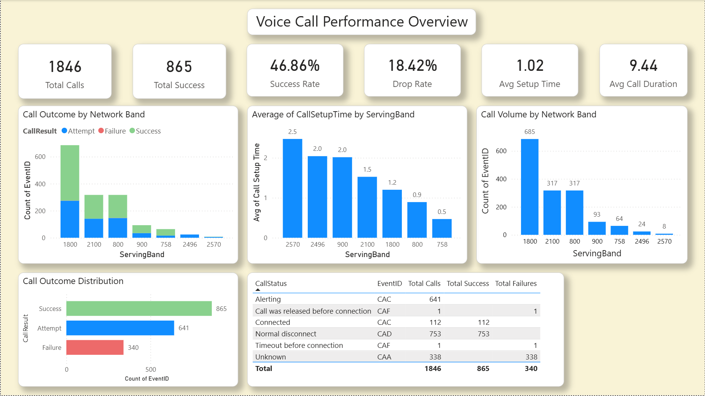
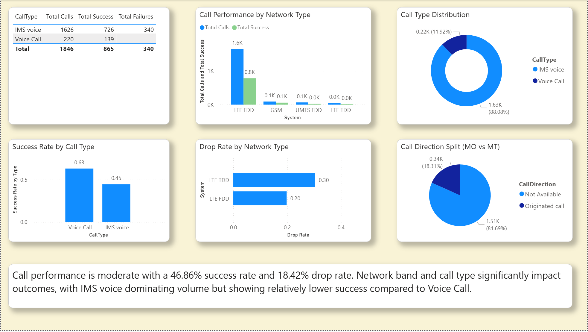

# 📞 Voice Call Performance Dashboard

## 🚀 Project Overview
This project analyzes voice call performance data to evaluate key telecom KPIs such as call success rate, drop rate, call setup time, and call duration.

The dashboard provides insights into how network type, band, and call type impact overall call quality and user experience.

---

## 🎯 Business Objective
To monitor and improve voice call quality by identifying:
- Call failures and drop patterns  
- Network performance issues  
- Differences between IMS and Voice Call performance  

---

## 🛠️ Tools Used
- Power BI  
- Excel  
- SQL (basic concepts)

---

## 📊 Key KPIs
- Total Calls  
- Total Success  
- Success Rate  
- Drop Rate  
- Avg Call Setup Time  
- Avg Call Duration  

---

## 🖼️ Dashboard Preview

---

## 📈 Key Insights
- Overall call performance is moderate with ~46% success rate  
- Drop rate is relatively high (~18%), indicating network stability issues  
- LTE FDD handles majority of call volume  
- IMS voice dominates call volume but has lower success rate compared to normal voice calls  
- Network band significantly impacts call setup time and performance  

---

## 🧠 Analysis Performed
- Call outcome distribution analysis  
- Network band performance comparison  
- Call type segmentation (IMS vs Voice Call)  
- Drop rate analysis across network types  
- Call direction analysis (MO vs MT)  

---

## 📁 Project Structure

---

## 🚀 How to Use
1. Download the `.pbix` file  
2. Open in Power BI Desktop  
3. Explore visuals and filters  

---

## 👩‍💻 About Me
Transitioning into a Data Analyst role with hands-on experience in:
- Data analysis  
- KPI tracking  
- Dashboard development  
- Insight generation  

---

⭐ If you like this project, feel free to star the repository!
